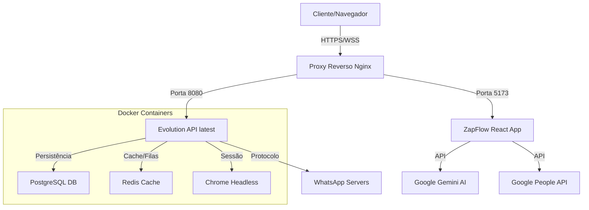

# ⚡ ZapFlow Manager v1.3.0

**Plataforma Enterprise de Gestão de Atendimento para WhatsApp**

O **ZapFlow Manager** é uma solução completa para centralizar, organizar e escalar o atendimento via WhatsApp da sua empresa. Desenvolvido para transformar o WhatsApp em uma ferramenta de ticket profissional, ele elimina a desorganização de múltiplos celulares e centraliza tudo em um único painel multi-agente.

---

## 🚀 Funcionalidades Principais

### 🗣️ Gestão de Atendimento
*   **Multi-Agente:** Vários atendentes utilizando o mesmo número de WhatsApp simultaneamente.
*   **Departamentalização:** Separe os atendimentos por setores (Comercial, Suporte, Financeiro).
*   **Transferência Inteligente:** Transfira chats entre agentes ou departamentos com histórico completo.
*   **Inbox Zero:** Organização automática de chats (Abas: A Fazer, Aguardando, Finalizados).

### 🤖 Inteligência e Automação
*   **IA Gemini (Google):** Sugestão de respostas inteligentes baseadas no contexto da conversa com um clique.
*   **Chatbot & Horários:** Defina horários de funcionamento e mensagens automáticas de ausência/saudação.
*   **Fluxos de Trabalho (SOP):** Crie checklists padronizados (ex: "Protocolo de Venda") para guiar os operadores passo-a-passo.

### 🛠️ Ferramentas de Produtividade
*   **Google Contacts Sync:** Sincronização bidirecional de contatos com sua conta Google.
*   **Respostas Rápidas:** Biblioteca de mensagens pré-definidas (atalhos).
*   **Multimídia Completa:** Envio de Áudio (gravador nativo), Imagens, Vídeos, Documentos e Stickers.
*   **Tags e Etiquetas:** Classifique clientes visualmente (VIP, Inadimplente, Novo Lead).

### 📊 Gestão e Dados
*   **Dashboard de Relatórios:** Métricas de volume, tempo médio de atendimento e SLA.
*   **Pesquisa de Satisfação (CSAT):** Envio automático de pesquisa ao finalizar atendimento.
*   **Exportação CSV:** Download de todos os dados de atendimento para BI externo.

---

## 🏗️ Arquitetura do Sistema

O sistema utiliza uma arquitetura moderna baseada em microsserviços containerizados, garantindo estabilidade e escalabilidade.



### Stack Tecnológica
*   **Frontend:** React 19, TypeScript, Vite 6, Tailwind CSS 3 (PostCSS), Socket.IO Client 4, Lucide Icons.
*   **Backend (Core):** Evolution API latest (Node.js/Baileys).
*   **Backend API:** Node.js/Express, PostgreSQL, JWT Authentication.
*   **Infraestrutura:** Docker, Docker Compose, PM2, Nginx.
*   **Banco de Dados:** PostgreSQL 15, Redis.
*   **Tempo Real:** Socket.IO (WebSocket com fallback para polling HTTP).

---

## 📚 Manuais de Implantação

Este repositório contém guias específicos para diferentes cenários de infraestrutura. Escolha o adequado para você:

### 🚀 0. Instalação Automática (Recomendado)
Use o script mágico para instalar tudo (Docker, Node, API, App) em 5 minutos em uma VPS limpa.
1. Crie o arquivo: `nano autoinstall.sh`
2. Cole o conteúdo de **[install/autoinstall.txt](./install/autoinstall.txt)**
3. Execute: `bash autoinstall.sh`

### 1. Instalação Manual (Ubuntu/Debian)
Para servidores VPS limpos (DigitalOcean, AWS, Vultr, Local VM).
📄 **[install/manual_instalacao_completo.txt](./install/manual_instalacao_completo.txt)**

### 2. Instalação HostGator VPS
Instruções específicas para lidar com as particularidades da HostGator (Firewall, Apache pré-instalado).
📄 **[install/deploy_hostgator.txt](./install/deploy_hostgator.txt)**

### 3. Deploy em Produção (Domínio & HTTPS)
Como configurar Nginx, Domínio `.com.br` e Certificado SSL Gratuito (Let's Encrypt).
📄 **[install/deploy.txt](./install/deploy.txt)**

### 4. Segurança Avançada
Como blindar seu servidor contra ataques DDoS e invasões.
📄 **[install/security_hostgator.txt](./install/security_hostgator.txt)**

---

## 🛠️ Scripts de Automação e Correção

Os scripts abaixo podem ser executados diretamente ou criados no servidor a partir dos arquivos .txt. Consulte o **[install/manual_instalacao_completo.txt](./install/manual_instalacao_completo.txt)** para instruções detalhadas.

### Scripts Shell (.sh)
*   **[scripts/upgrade_evolution.sh](./scripts/upgrade_evolution.sh)**: Atualiza Evolution API para a versão mais recente.
*   **[scripts/factory_reset_complete.sh](./scripts/factory_reset_complete.sh)**: **Cuidado!** Apaga tudo e reinicia a instalação (Factory Reset completo).
*   **[scripts/setup_backend.sh](./scripts/setup_backend.sh)**: Instala e configura o backend PostgreSQL automaticamente (Linux/macOS).
*   **[scripts/setup_backend.ps1](./scripts/setup_backend.ps1)**: Instala e configura o backend PostgreSQL automaticamente (Windows).

### Scripts de Instalação (.txt - criar como .sh no servidor)
*   **[install/setup_evolution.txt](./install/setup_evolution.txt)**: Instala Docker, Banco de Dados e API do zero.
*   **[install/factory_reset.txt](./install/factory_reset.txt)**: **Cuidado!** Apaga tudo e reinicia a instalação (Factory Reset).
*   **[install/debug.txt](./install/debug.txt)**: Diagnóstico de rede e conexão.
*   **[install/fix_evolution_network.txt](./install/fix_evolution_network.txt)**: Corrige problemas de firewall do Docker (Erro de QR Code não gerado).

---

## 💾 Persistência de Dados

O ZapFlow agora suporta persistência segura de dados usando PostgreSQL:

### Backend API (Recomendado)

O sistema inclui um backend completo com:
- **PostgreSQL** para armazenamento seguro
- **Autenticação JWT** para segurança
- **API REST** para salvar/carregar dados
- **Sistema híbrido**: Usa API quando disponível, localStorage como fallback

#### Instalação Rápida do Backend

**Linux/macOS:**
```bash
./scripts/setup_backend.sh
```

**Windows:**
```powershell
.\scripts\setup_backend.ps1
```

Para instruções detalhadas, consulte:
- **[INSTALACAO_BACKEND.md](./INSTALACAO_BACKEND.md)** - Guia completo
- **[backend/README.md](./backend/README.md)** - Documentação da API

### Dados Persistidos

Com o backend configurado, os seguintes dados são salvos no PostgreSQL:
- ✅ Configurações da API
- ✅ Chats e mensagens
- ✅ Contatos
- ✅ Usuários
- ✅ Departamentos
- ✅ Respostas rápidas
- ✅ Workflows
- ✅ Configuração do chatbot
- ✅ Preferências de UI

**Sem backend:** Os dados são salvos no localStorage do navegador (específico por navegador).

---

## 📞 Suporte e Créditos

## 🔄 Atualizações Recentes (v1.3.0)

### ✨ Novidades
- ✅ **Socket.IO Client** implementado para mensagens em tempo real
- ✅ **Tailwind CSS** configurado para produção (PostCSS)
- ✅ **Criptografia de dados sensíveis** no localStorage
- ✅ **Opção de usar apenas PostgreSQL** (sem localStorage)
- ✅ **CRUD completo** para Departamentos, Contatos, Respostas Rápidas e Workflows
- ✅ **Chatbot funcional** com marcação de mensagens enviadas
- ✅ **Melhorias de segurança** e performance

### 🔧 Melhorias Técnicas
- **Socket.IO:** Substituído WebSocket nativo por `socket.io-client` para conexão estável
- **Tailwind CSS:** Migrado de CDN para build local com PostCSS e Autoprefixer
- **Segurança:** Dados sensíveis (API keys, tokens, usuários) criptografados no localStorage
- **Performance:** CSS otimizado e minificado no build de produção
- **Logs:** Filtros inteligentes para reduzir poluição do console

---

**Desenvolvido por:** Andrey Gheno Piekas  
**Versão Atual:** 1.3.0 (Stable)  
**Licença:** Proprietária
