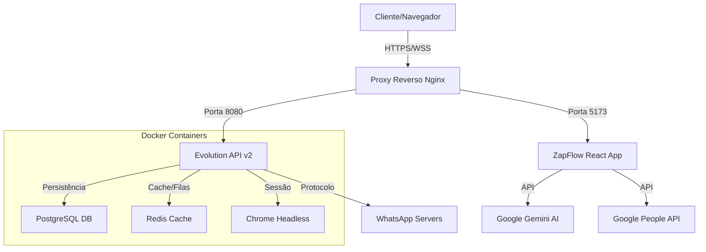

# ⚡ ZapFlow Manager v1.2.0

**Plataforma Enterprise de Gestão de Atendimento para WhatsApp**

O **ZapFlow Manager** é uma solução completa para centralizar, organizar e escalar o atendimento via WhatsApp da sua empresa. Desenvolvido para transformar o WhatsApp em uma ferramenta de ticket profissional, ele elimina a desorganização de múltiplos celulares e centraliza tudo em um único painel multi-agente.

---

## 🚀 Funcionalidades Principais

### 🗣️ Gestão de Atendimento
*   **Multi-Agente:** Vários atendentes utilizando o mesmo número de WhatsApp simultaneamente.
*   **Departamentalização:** Separe os atendimentos por setores (Comercial, Suporte, Financeiro).
*   **Transferência Inteligente:** Transfira chats entre agentes ou departamentos com histórico completo.
*   **Inbox Zero:** Organização automática de chats (Abas: A Fazer, Aguardando, Finalizados).

### 🤖 Inteligência e Automação
*   **IA Gemini (Google):** Sugestão de respostas inteligentes baseadas no contexto da conversa com um clique.
*   **Chatbot & Horários:** Defina horários de funcionamento e mensagens automáticas de ausência/saudação.
*   **Fluxos de Trabalho (SOP):** Crie checklists padronizados (ex: "Protocolo de Venda") para guiar os operadores passo-a-passo.

### 🛠️ Ferramentas de Produtividade
*   **Google Contacts Sync:** Sincronização bidirecional de contatos com sua conta Google.
*   **Respostas Rápidas:** Biblioteca de mensagens pré-definidas (atalhos).
*   **Multimídia Completa:** Envio de Áudio (gravador nativo), Imagens, Vídeos, Documentos e Stickers.
*   **Tags e Etiquetas:** Classifique clientes visualmente (VIP, Inadimplente, Novo Lead).

### 📊 Gestão e Dados
*   **Dashboard de Relatórios:** Métricas de volume, tempo médio de atendimento e SLA.
*   **Pesquisa de Satisfação (CSAT):** Envio automático de pesquisa ao finalizar atendimento.
*   **Exportação CSV:** Download de todos os dados de atendimento para BI externo.

---

## 🏗️ Arquitetura do Sistema

O sistema utiliza uma arquitetura moderna baseada em microsserviços containerizados, garantindo estabilidade e escalabilidade.

### Stack Tecnológica
*   **Frontend:** React 18, TypeScript, Vite, Tailwind CSS, Lucide Icons.
*   **Backend (Core):** Evolution API v2.2.3 (Node.js/Baileys).
*   **Infraestrutura:** Docker, Docker Compose, PM2, Nginx.
*   **Banco de Dados:** PostgreSQL 15, Redis.

---

## 📚 Manuais de Implantação

Este repositório contém guias específicos para diferentes cenários de infraestrutura. Escolha o adequado para você:

### 🚀 0. Instalação Automática (Recomendado)
Use o script mágico para instalar tudo (Docker, Node, API, App) em 5 minutos em uma VPS limpa.
1. Crie o arquivo: `nano autoinstall.sh`
2. Cole o conteúdo de **[autoinstall.txt](./autoinstall.txt)**
3. Execute: `bash autoinstall.sh`

### 1. Instalação Manual (Ubuntu/Debian)
Para servidores VPS limpos (DigitalOcean, AWS, Vultr, Local VM).
📄 **[manual_instalacao_completo.txt](./manual_instalacao_completo.txt)**

### 2. Instalação HostGator VPS
Instruções específicas para lidar com as particularidades da HostGator (Firewall, Apache pré-instalado).
📄 **[deploy_hostgator.txt](./deploy_hostgator.txt)**

### 3. Deploy em Produção (Domínio & HTTPS)
Como configurar Nginx, Domínio `.com.br` e Certificado SSL Gratuito (Let's Encrypt).
📄 **[deploy.txt](./deploy.txt)**

### 4. Segurança Avançada
Como blindar seu servidor contra ataques DDoS e invasões.
📄 **[security_hostgator.txt](./security_hostgator.txt)**

---

## 🛠️ Scripts de Automação e Correção

Os scripts abaixo (formato .txt) devem ser criados no servidor como .sh para execução. Consulte o **[manual_instalacao_completo.txt](./manual_instalacao_completo.txt)** para instruções detalhadas de como criar e rodar.

*   `setup_evolution.txt`: Instala Docker, Banco de Dados e API do zero.
*   `factory_reset.txt`: **Cuidado!** Apaga tudo e reinicia a instalação (Factory Reset).
*   `debug.txt`: Diagnóstico de rede e conexão.
*   `fix_evolution_network.txt`: Corrige problemas de firewall do Docker (Erro de QR Code não gerado).

---

## 📞 Suporte e Créditos

**Desenvolvido por:** Andrey Gheno Piekas
**Versão Atual:** 1.2.0 (Stable)
**Licença:** Proprietária
